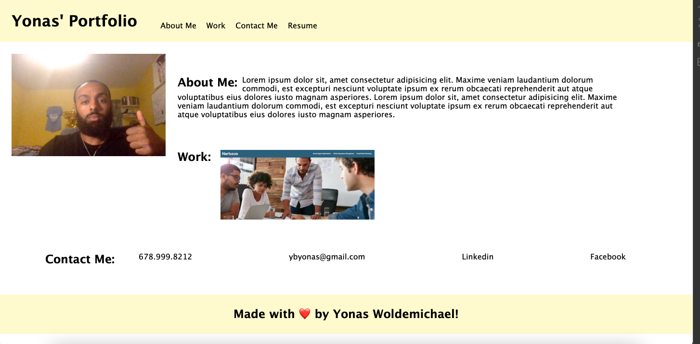

# Portfolio Homework

## Table of Contents
- [Description](#description)
- [Installation](#installation)
- [Visuals](#visuals)
- [Usage](#usage)

## Description
In this assignment we were instructed to create a portfolio for ourselves. One, so that we can get a feel on how to utilize the topics that we've learned and discussed about in class, and two, to see first hand what a personalized porfolio may look like.

## Installation
Nothing major was installed except a few images that I decided to put into the portfolio

## Visuals
Although it may seem very plain, I am hoping I will be able to come back and provide a couple more tweaks to the portfolio

The following is a screenshot of the portfolio

not sure why that link isnt working

## Usage
The usage of the site is mainly for the student to display the projects that they have completed.

[Link to the deployed site](https://ybyonas1.github.io/portfolio-hw/)

[Link to the github site](https://github.com/Ybyonas1/portfolio-hw/settings/pages#:~:text=/-,portfolio-hw,-Public)

### Assignment by - Yonas Woldemichael