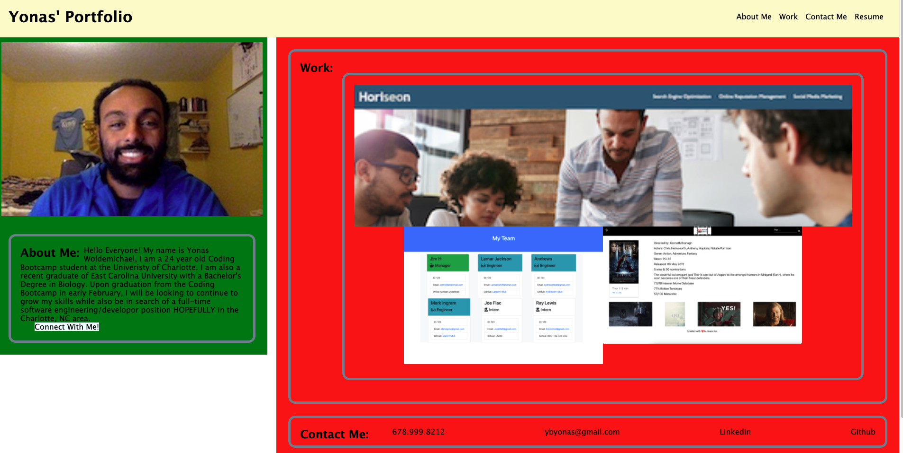

# 1st Updated Portfolio
by: Yonas Woldemichael

## Table of Contents
- [Description](#description)
- [Installation](#installation)
- [Visuals](#visuals)
- [Usage](#usage)

## Description
In this assignment we were instructed to update our portfolio. I know this may seem like a rough copy, but I do plan on making continuous edits to improve the porfolio of course.

## Installation
Nothing major was installed except a few images that I added to the portfolio.

## Visuals
Although it may seem very plain, I am hoping I will be able to come back and provide a more tweaks to the portfolio.

The following is a screenshot of the portfolio.

## Usage
The usage of the site is mainly for the student to display the projects that they have completed.

[Link to the deployed site](https://ybyonas1.github.io/portfolio-hw/)

[Link to the github site](https://github.com/Ybyonas1/portfolio-hw/settings/pages#:~:text=/-,portfolio-hw,-Public)

### Assignment by - Yonas Woldemichael