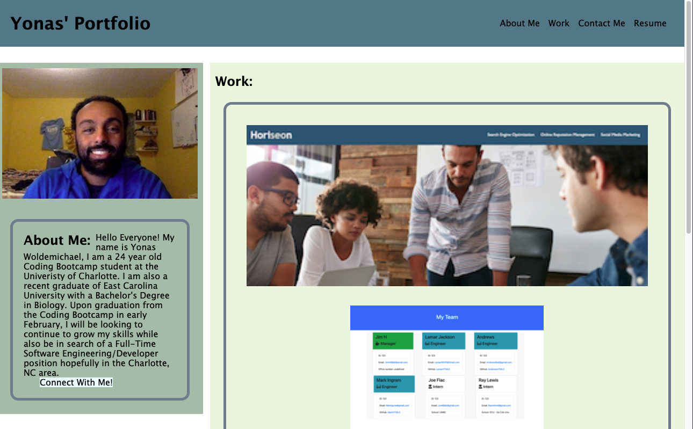

# 1st Updated Portfolio
by: Yonas Woldemichael

## Table of Contents
- [Description](#description)
- [Installation](#installation)
- [Visuals](#visuals)
- [Usage](#usage)

## Description
In this assignment we were instructed to add the neccessary revisions to update our portfolio. 

## Installation
Nothing major was installed except a few images that I added to the portfolio.

## Visuals
The layout of my portfolio has a very simple design.

The following is a screenshot of the portfolio.

## Usage
The usage of the site is mainly for the student to display the projects that they have completed, while also being able to exercise their CSS and HTML skills.

[Link to the deployed site](https://ybyonas1.github.io/portfolio-hw/)

[Link to the github site](https://github.com/Ybyonas1/portfolio-hw/settings/pages#:~:text=/-,portfolio-hw,-Public)

### Assignment by - Yonas Woldemichael